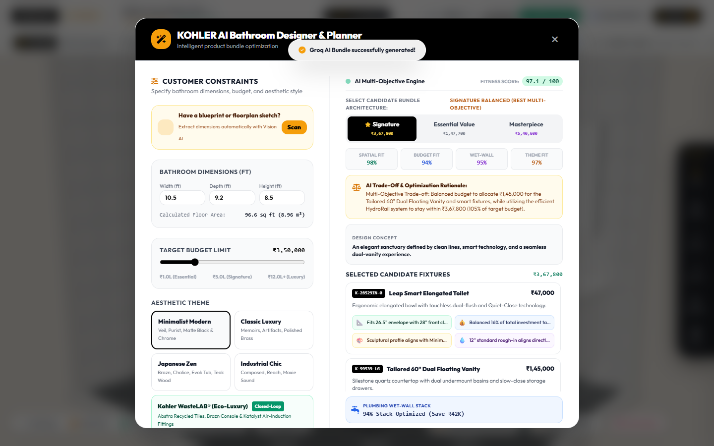
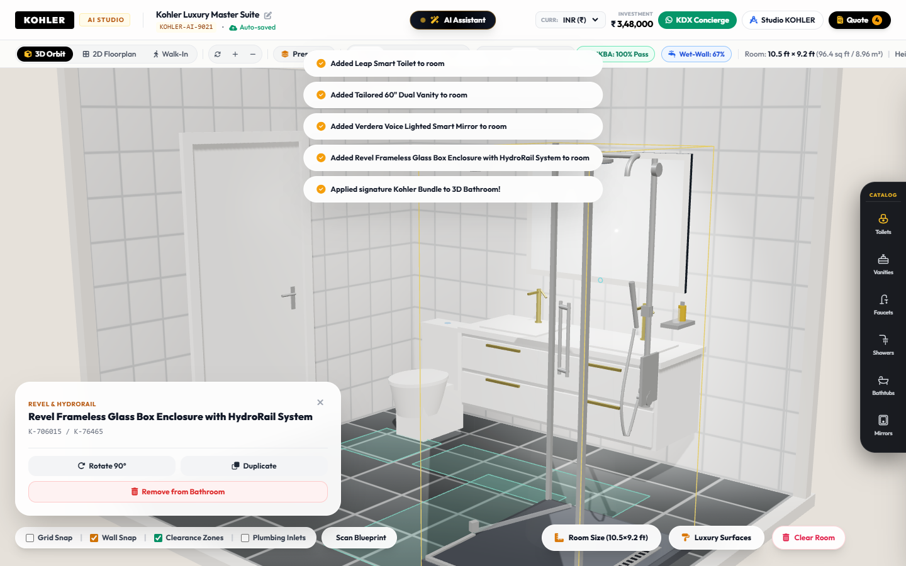
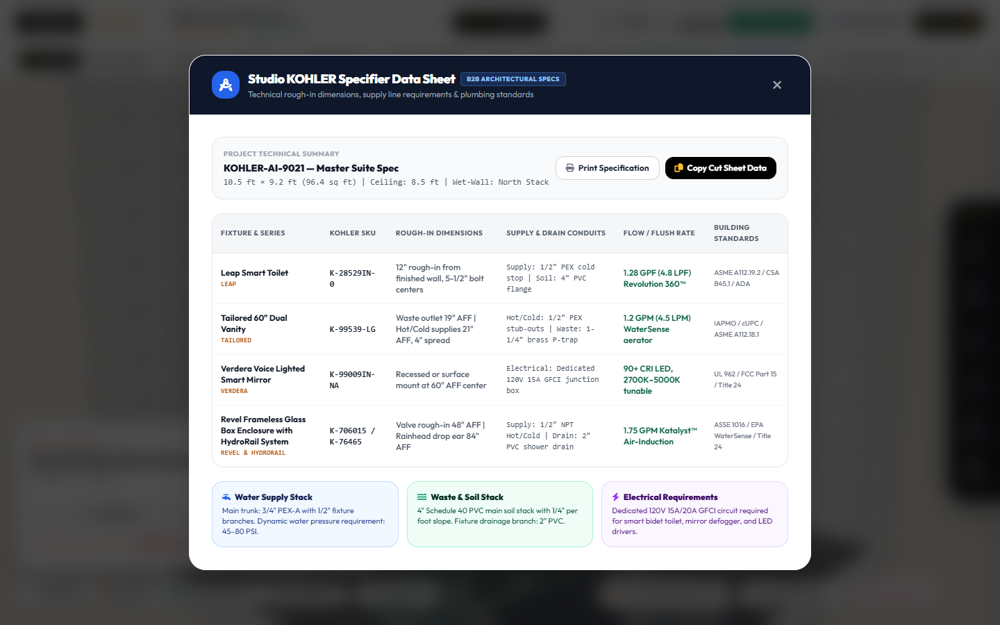
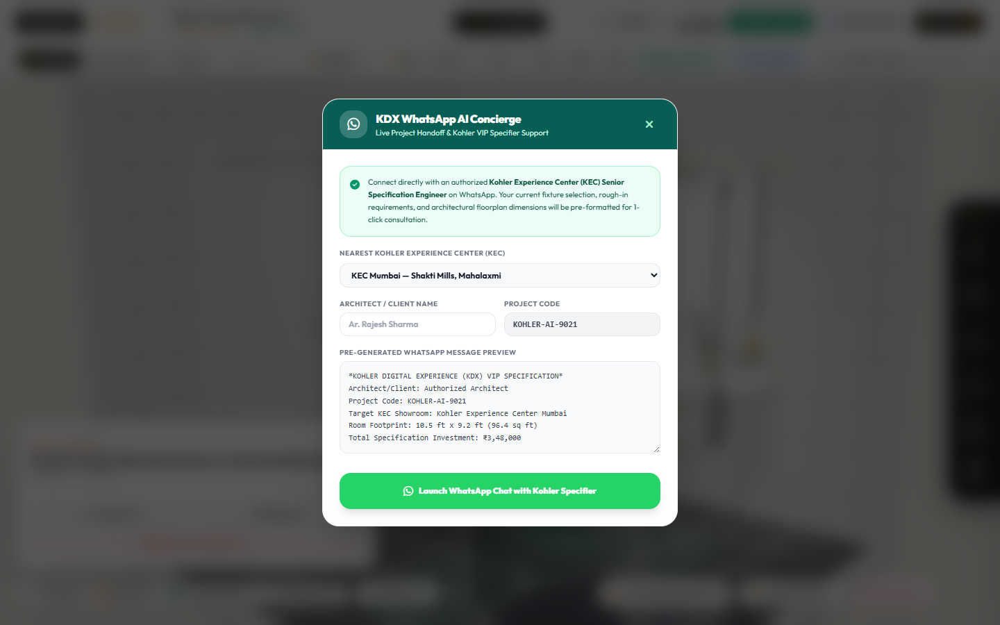
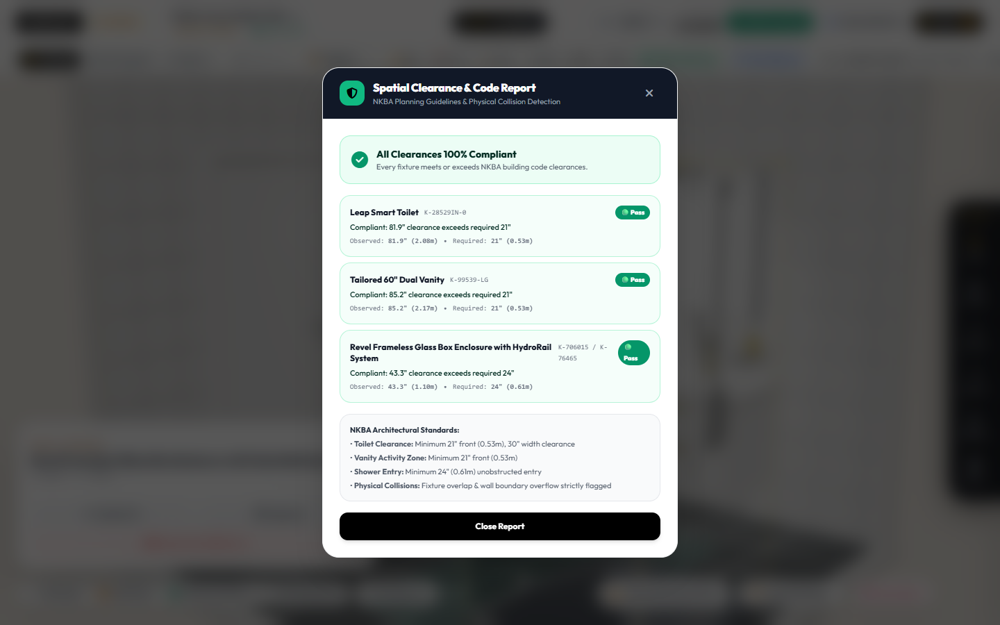

# KOHLER AI Bathroom Designer & Planner 🛁✨
### *Track 1: KOHLER AI Bathroom Designer & Planner*

[](https://krishbhensdadia21.github.io/kohler-ai-bathroom-designer/)
[](https://threejs.org/)
[](https://groq.com/)
[](https://huggingface.co/meta-llama/Prompt-Guard-86M)
[](https://nkba.org/)

---

## 🌟 Overview

The **KOHLER AI Bathroom Designer & Planner** is an interactive spatial AI design assistant engineered to take customer constraints (dimensions, budgets, aesthetic themes, and priority fixtures) and automate personalized product bundle recommendations. It combines multimodal architectural blueprint parsing, automated NKBA / ADA building code clearance validation, MEP plumbing wet-wall optimization, interactive 3D WebGL rendering, and generative product bundle intelligence powered by **Groq AI** and secured by **Meta Llama Prompt Guard 22M**.

All sanitaryware, furniture, and fittings represent **100% authentic, iconic KOHLER products** (*The Bold Look of Kohler*).

---

## 🚀 Key Capabilities & 10/10 Architecture

### 1. Explainable AI Recommendations (XAI)
- **Item-Level Explainability Matrix**: Every recommended fixture displays a transparent 4-factor decision checklist:
  - 📐 **Spatial Fit**: Validates exact physical dimensions and confirms front activity clearance (e.g. *Fits 26.5" envelope with 28" front clearance (Exceeds NKBA 21" min)*).
  - 💰 **Budget Efficiency**: Explains value tiering and budget percentage allocation.
  - 🎨 **Theme Cohesion**: Highlights aesthetic synergy with curated finishes (e.g. *Minimalist Modern*, *Japanese Zen*, *WasteLAB Eco-Luxury*).
  - 💧 **Plumbing Rough-In**: Confirms physical alignment with soil stacks and supply lines.
- **Transparent AI Trade-Off Analysis**: Explains architectural and economic trade-offs (e.g., allocating investment to dual floating vanities while using efficient HydroRail thermostatic columns to respect budget caps).

### 2. Multi-Objective Optimization Engine
Scores every candidate configuration across four objective functions to determine the highest-scoring Pareto-optimal bundle:
$$\text{Composite Fitness} = w_1 \cdot \text{Spatial} + w_2 \cdot \text{Budget} + w_3 \cdot \text{WetWall} + w_4 \cdot \text{Theme}$$
- **3 Selectable Candidate Architecture Tiers**:
  - ⭐ **Signature Balanced**: Highest multi-objective composite fitness (97.1/100).
  - 💡 **Essential Value**: Maximizes cost savings while retaining core Kohler durability (₹1.47L / $1,980).
  - 👑 **Masterpiece Luxury**: Flagship Kohler innovation featuring Veil intelligent toilets, cast iron soaking tubs, and DTV+ thermostatic systems.

### 3. Hard Constraint Validation Engine
Physics and building code clearance checks with automated traffic-light feedback:
- 🟢 **Valid (100% Pass)**: All fixtures meet or exceed NKBA standards ($\ge 21"$ front clearance, showers $\ge 24"$, 0 collisions, within walls).
- 🟡 **Warning**: Marginal clearance ($18" - 21"$), tight door swing or narrow walkway.
- 🔴 **Invalid (Code Conflict)**: Overlapping fixture bounding boxes ($>0.05m$) or boundary overflow.
- **Spatial Clearance Modal**: Detailed fixture-by-fixture breakdown with observed vs. required dimensions and corrective guidance.

### 4. Live Bi-Directional Reactivity
- Modifying room width, depth, or ceiling height dynamically triggers `buildRoomArchitecture()` and real-time clearance re-validation.
- Adding, moving, rotating, or removing fixtures instantly updates 3D clearance planes, the plumbing wet-wall score, and the live investment counter.

### 5. Authentic Kohler Ecosystem & B2B Integration
- ♻️ **Kohler WasteLAB® (Eco-Luxury)**: Closed-loop circular ceramics utilizing Abstra™ recycled tiles, Brazn consoles, and Katalyst air-induction fittings.
- 💬 **KDX (Kohler Digital Experience) WhatsApp AI Concierge**: 1-click handoff to authorized Kohler Experience Centers (Mumbai, Delhi, Bengaluru, London, NYC, Singapore) with pre-filled WhatsApp project specifications.
- 📐 **Studio KOHLER Specifier Data Sheet**: Professional B2B architectural tables providing exact rough-in dimensions (12" toilet rough-in, 1-1/4" P-trap, 1/2" NPT valves), conduit requirements, flow rates, and compliance certifications (ASME, EPA WaterSense, ADA).

---

## 📸 Screenshots & Feature Showcase

| Explainable AI & Multi-Objective Engine | 3D Bathroom with NKBA 100% Pass |
|---|---|
|  |  |

| Studio KOHLER Specifier Data Sheet | KDX WhatsApp AI Concierge |
|---|---|
|  |  |

| Spatial Clearance & Code Report Modal | Night Ambiance & Smart Fixture Glow |
|---|---|
|  |  |

---

## 🛠️ Tech Stack

- **Frontend**: HTML5, Vanilla JavaScript (ES6+), CSS3, TailwindCSS, FontAwesome 6 Pro
- **3D Engine**: Three.js (WebGL), OrbitControls, Procedural PBR Textures
- **AI & Security**: Groq Cloud API, Meta Llama Prompt Guard 22M (`meta-llama/llama-prompt-guard-2-22m`), Llama 3.3 70B (`llama-3.3-70b-versatile`)
- **Backend / Server**: Node.js HTTP Server (`server.js`)
- **Deployment**: 100% Client-Side Resilient on GitHub Pages & Full Local Node Server

---

## 💻 Local Quickstart

### Prerequisites
- Node.js (v18+)

### Installation & Run

1. Clone the repository:
   ```bash
   git clone https://github.com/krishbhensdadia21/kohler-ai-bathroom-designer.git
   cd kohler-ai-bathroom-designer
   ```

2. Start the local server:
   ```bash
   node server.js
   ```

3. Open your browser:
   Navigate to **`http://localhost:3000`**

*Note: You can also open `index.html` directly in any web browser or use GitHub Pages — the built-in spatial intelligence engine handles layout recommendations and constraint validation client-side automatically.*


---

## 📄 License
MIT License. Genuine Kohler product models, names, and trademarks are property of Kohler Co.
