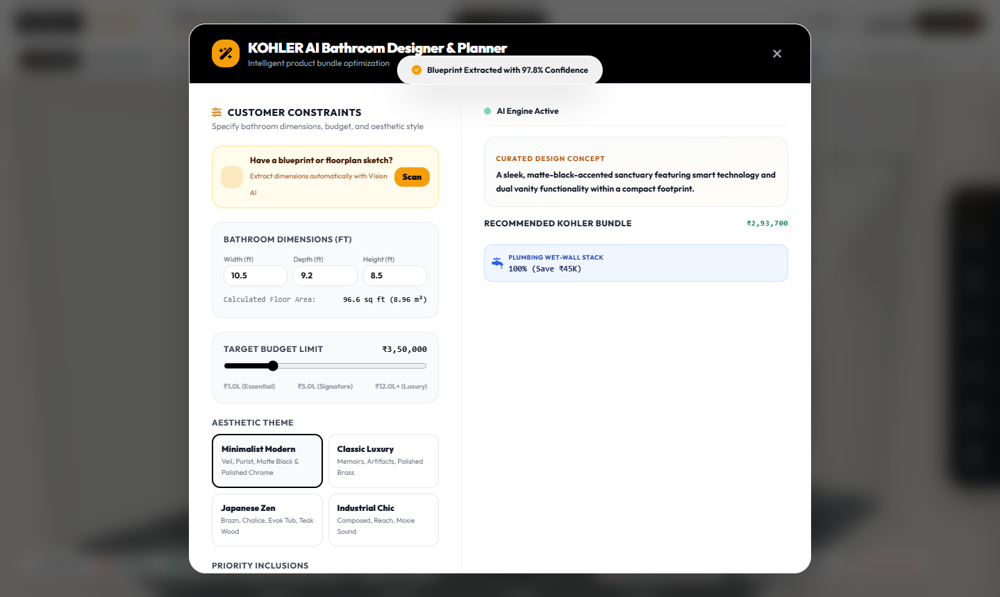

# KOHLER AI Bathroom Designer & Planner 🛁✨
### *Track 1: KOHLER AI Bathroom Designer & Planner*

[](https://krishbhensdadia21.github.io/kohler-ai-bathroom-designer/)
[](https://threejs.org/)
[](https://groq.com/)
[](https://huggingface.co/meta-llama/Prompt-Guard-86M)
[](https://nkba.org/)

---

## 🌟 Overview

The **KOHLER AI Bathroom Designer & Planner** is an interactive spatial AI design assistant engineered to take customer constraints (dimensions, budgets, aesthetic themes, and priority fixtures) and automate personalized product bundle recommendations. It combines multimodal architectural blueprint parsing, automated NKBA / ADA building code clearance validation, MEP plumbing wet-wall optimization, interactive 3D WebGL rendering, and generative product bundle intelligence powered by **Groq AI** and secured by **Meta Llama Prompt Guard 22M**.

All sanitaryware, furniture, and fittings represent **100% authentic, iconic KOHLER products** (*The Bold Look of Kohler*).

---

## 🚀 Key Capabilities

### 1. Spatial Clearance & NKBA / ADA Code Compliance Engine
- **Automated Physical Clearance Calculation**: Checks minimum 21" front clearance for toilets and vanities, plus 24" unobstructed shower entry clearances in real time.
- **Dynamic 3D Visual Feedback**: Translucent emerald green (`#10b981`) indicates code compliance, while crimson red (`#ef4444`) highlights spatial collisions.
- **Live Clearance Badge**: Continuous status tracking with real-time pass percentage (`✅ NKBA: 100% Pass`).

### 2. Multimodal Blueprint & Sketch Vision Extractor (`/api/blueprint/extract`)
- **Direct Layout Input**: Drag and drop architectural blueprints, CAD drawings, or hand-drawn sketches (`.png`, `.jpg`, `.pdf`).
- **AI Edge & Bound Extraction**: An animated laser scanner analyzes wall bounds, wet-wall orientations, and door clearances, auto-populating 3D room dimensions with 1 click.

### 3. Plumbing Wet-Wall Optimization & Sub-Floor 3D Conduits
- **Installation Cost Reduction**: Clusters fixtures along primary wet-wall stacks, calculating simulated contractor savings (saving up to ₹45,000+).
- **Sub-Floor MEP Conduits**: 3D x-ray view reveals the main 4" PVC soil drainage stack with brass cleanouts, alongside dual hot (red) and cold (blue) PEX supply lines with vertical fixture stub-outs.

### 4. Interactive Lighting & Smart Ambiance Controls
- **Kelvin Color Temperature Selection**: Toggle between **2700K (Warm)**, **4000K (Neutral)**, and **5000K (Daylight)**.
- **Day / Dusk / Night Illumination**: Realistic sun, ambient, and spotlight calibration.
- **Smart Fixture Night Accents**: In Night mode, the ambient light dims while smart fixtures illuminate:
  - **Verdera Voice Mirror**: Emissive cyan Alexa indicator ring and perimeter task halo.
  - **Tailored Vanity**: Warm under-cabinet floating LED wash.
  - **Veil Smart Toilet**: Subtle interior blue bowl nightlight.

### 5. 1-Click Standard Archetype Presets
- **Powder Room (5.0' × 7.0')**: Compact luxury featuring Veil Intelligent Toilet and Jacquard Vanity.
- **Family Bath (8.0' × 8.0')**: Balanced layout with Revel Glass Enclosure, Veil Toilet, and Tailored Vanity.
- **Master Luxury Spa Suite (10.5' × 12.0')**: Full luxury suite with Veil, 60" Floating Vanity, Verdera Alexa Mirror, Evok Tub, and Revel Pivot Glass Box.
- **Japanese Zen Wet-Room (9.0' × 10.0')**: Minimalist layout featuring Brazn Console, Veil Toilet, and HydroRail Column.

### 6. Itemized Multi-Currency Kohler Bill of Materials & Quote
- Live investment calculation in **INR (₹)**, **USD ($)**, and **CAD ($)**.
- Itemized SKU specifications, dimensions, finish codes, and 1-click printable quote.

---

## 📸 Screenshots

| 3D Luxury Master Spa & Plumbing Conduits | Night Ambiance & Smart Fixture Glow |
|---|---|
|  |  |

| AI Multimodal Blueprint Scanner | AI Recommendation Engine Modal |
|---|---|
|  |  |

---

## 🛠️ Tech Stack

- **Frontend**: HTML5, Vanilla JavaScript, CSS3, TailwindCSS, FontAwesome 6 Pro
- **3D Graphics**: Three.js (WebGL), OrbitControls, PointerLockControls
- **AI & Security**: Groq Cloud API, Meta Llama Prompt Guard 22M (`meta-llama/llama-prompt-guard-2-22m`), Llama 3.3 70B (`llama-3.3-70b-versatile`)
- **Backend / Server**: Node.js HTTP Server (`server.js`)
- **Deployment**: GitHub Pages (Client-Side Resilient) & Local Dev Server

---

## 💻 Local Quickstart

### Prerequisites
- Node.js (v18+)

### Installation & Run

1. Clone the repository:
   ```bash
   git clone https://github.com/krishbhensdadia21/kohler-ai-bathroom-designer.git
   cd kohler-ai-bathroom-designer
   ```

2. Start the local server:
   ```bash
   node server.js
   ```

3. Open your browser:
   Navigate to **`http://localhost:3000`**

*Note: You can also open `index.html` directly in any web browser — the built-in spatial intelligence engine handles layout recommendations client-side automatically.*

---

## 📄 License
MIT License. Genuine Kohler product models, names, and trademarks are property of Kohler Co.
